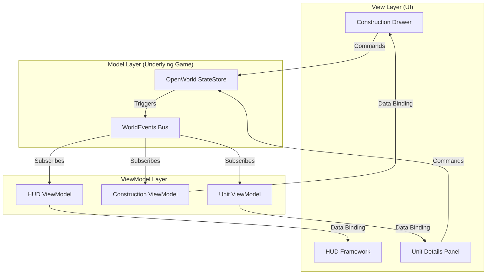
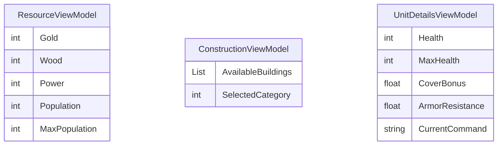
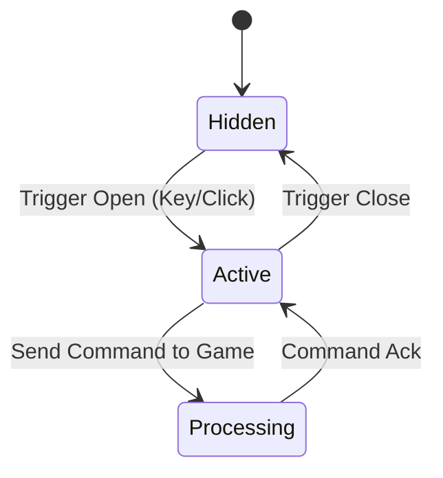

# Architecture Overview

## 1. System Context & Style
本项目架构采用 **MVVM（Model-View-ViewModel）** 与 **事件驱动 (Event-Driven)** 相结合的风格。
UI 渲染层（View）完全独立于底层开放世界游戏状态（Model）。二者通过 ViewModel 防腐层桥接，借助 `WorldEvents` 事件总线进行单向数据流的同步。

## 2. Core Components

## 3. Technology Stack
- **Engine**: Unity 3D
- **Language**: C#
- **UI Framework**: Unity UI Toolkit (推荐用于响应式流式布局) 或 UGUI
- **Reactive Framework**: UniRx (用于提供可观察的 ReactiveProperty)
- **Dependency Injection**: VContainer (可选，用于解耦 ViewModel 注入)

## 4. Data Model (ViewModel Entities)

## 5. State Machine: UI Lifecycle

| Current State | Event | Next State | Action |
|---|---|---|---|
| Hidden | OnToggleDrawer | Active | Play Slide-in Animation, Subscribe to VM |
| Active | OnClickBuild | Processing | Block input, emit `BuildCommand` to Game State |
| Processing | OnStateUpdated | Active | Unblock input, update UI feedback |
| Active | OnToggleDrawer/ClickOutside | Hidden | Play Slide-out Animation, Unsubscribe VM |

## 6. Configuration Model
所有 UI 相关的配置将提取至独立的 `ScriptableObject` (`UIDataConfig`)。
| Field | Type | Default | Constraint |
|---|---|---|---|
| `BlurIntensity` | float | 2.5 | 0.0 - 5.0 (Performance bound) |
| `DrawerSlideDuration` | float | 0.2 | 0.1 - 1.0 (Seconds) |
| `DarkOverlayAlpha` | float | 0.4 | 0.0 - 1.0 |

## 7. Error Handling Strategy
- **Transient**: 如游戏底层响应延迟，UI 层保持 `Processing` 状态，显示 Loading/Waiting 动画。
- **Permanent**: 如绑定的实体已死亡/被销毁，ViewModel 捕获该异常，下发清空面板指令，View 强制关闭。
- **Degraded**: GPU 不支持高级 Shader (Blur)，自动降级为单纯的深色半透明底板。

## 8. Observability & Profiling
- **Metrics**: 记录每帧 UI 更新耗时 (CPU `ms`)。
- **Events**: 结构化日志输出（如 `UI_DRAWER_OPENED`, `UI_UNIT_SELECTED`）。
- **Health Checks**: Profiler 监听 `UniRx` 的 `OnNext` 调用频率，过高时触发警告。
- **Memory**: 在 CI 测试中校验场景切换后的引用计数，确保无内存泄漏。
