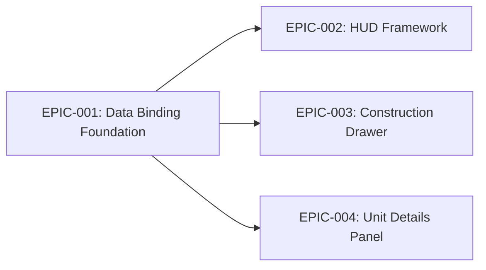

# Epics Overview

## 1. Epic Breakdown & Execution Order

| Epic ID | Title | Size | MVP | Traceability |
|---|---|---|---|---|
| **EPIC-001** | 响应式架构与绑定底座搭建 | L | Yes | NFR-ARCH-001 |
| **EPIC-002** | HUD 基础框架与材质渲染 | M | Yes | REQ-001, NFR-PERF-001 |
| **EPIC-003** | 边缘滑出式建设面板 | M | Yes | REQ-002 |
| **EPIC-004** | 单位详情与战斗指令面板 | L | Yes | REQ-003 |

**Execution Rationale**: 必须先完成 EPIC-001 铺设数据绑定底座，因为后续所有上层 UI 均依赖响应式数据流。之后可以并行开发 EPIC-002 (基础显示) 和 EPIC-003 (建造)。EPIC-004 逻辑最复杂（涉及多选聚合与战斗数值获取），最后执行。

## 2. Dependency Map

## 3. MVP Definition of Done
1. MonoBehavior `Update()` 不再用于 UI 数据同步，全面通过 ViewModel 事件驱动。
2. 玩家可以清晰地在玻璃化 HUD 上看到基础资源。
3. 玩家能够通过滑出的面板执行建筑放置，且不遮挡主摄像机视野。
4. 玩家框选单位时，面板能准确报告兵种数量、当前护甲和掩体防御。
