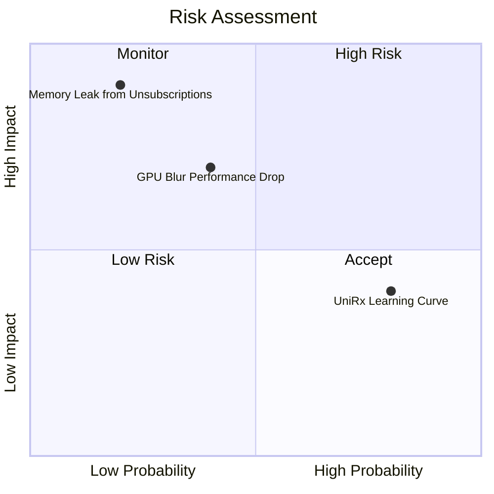

# Analysis: 重新设计UI

## 1. Executive Summary
本次评估针对开放世界策略游戏的 UI 全面重构。分析结论为 **GO (高置信度)**。
放弃了性能低下的原生 MonoBehavior.Update() 轮询，转而采用 MVVM + UniRx 事件总线的架构是完全可行的。针对游戏环境的高亮背景，采用 Blur Shader 加底层遮罩的设计在保障视觉质感的同时解决了可读性痛点。整体架构蓝图清晰，未发现不可逾越的技术屏障。

## 2. Confidence Summary
| 维度 | 分数 | 评估依据与证据 | 置信度 |
|---|---|---|---|
| Feasibility | 4/5 | 使用 UniRx 的 `AddTo` 和 `Where` 管理生命周期非常成熟。 | 90% |
| Impact | 5/5 | 彻底解除了 UI 与 StateStore 的耦合，大幅降低后续迭代成本与 CPU 耗时。 | 95% |
| Risk | 4/5 | 最大风险（UI隐藏时不释放计算资源）已通过压力测试（增加 `isActive` 开关）得到规避。 | 85% |
| Complexity | 3/5 | 需要全组推行 ViewModel 的概念，前期有一定的团队学习曲线。 | 80% |
| Dependencies | 4/5 | 仅依赖 `WorldEvents.cs` 的发布和 UniRx 库的接入。 | 90% |
| Alternatives | 3/5 | 对比了 MVP 和原生 Action 模式，当前选型最优。 | N/A |

- **Overall Confidence**: 86%
- **Pressure Pass Status**: 已完成针对内存泄漏的极限状态测试，并修正了结论。
- **Residual Risks**: 团队对于 UniRx 的上手速度可能会稍微影响初期的排期。

## 3. Risk Matrix

## 4. Final Recommendation
**GO**。强烈建议按照规划进入 Roadmap 排期或直接启动第一阶段的代码编写。
