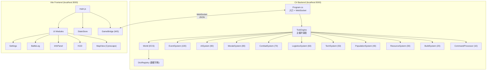
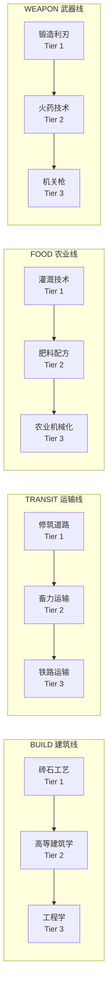

# 《文明模拟器》Demo — 技术架构文档

> 版本: 0.2.0 | 更新: 2026-05-22

---

## 1. 系统架构总览



---

## 2. 目录结构

```
open-world-game/
├── server/CivilizationSim/           # C# .NET 8 后端
│   ├── Dict/
│   │   ├── Data/                     # JSON 数据字典文件 (8 个)
│   │   │   ├── resources.json        # 资源定义
│   │   │   ├── buildings.json        # 建筑定义 (5 种 × 5 级)
│   │   │   ├── techs.json            # 科技定义 (12 个节点)
│   │   │   ├── units.json            # 兵种定义 (4 种)
│   │   │   ├── transports.json       # 运输定义 (3 种)
│   │   │   ├── factions.json         # 势力定义 (2 个)
│   │   │   ├── formulas.json         # 公式系数
│   │   │   └── map_default.json      # 地图定义 (17 节点 + 22 边)
│   │   ├── ResourceDef.cs            # 资源类型记录
│   │   ├── BuildingDef.cs            # 建筑类型记录
│   │   ├── TechDef.cs                # 科技类型记录
│   │   ├── UnitDef.cs                # 兵种类型记录
│   │   ├── TransportDef.cs           # 运输类型记录
│   │   ├── FactionDef.cs             # 势力类型记录
│   │   ├── FormulaDef.cs             # 公式系数记录
│   │   ├── MapDef.cs                 # 地图定义记录
│   │   └── DictRegistry.cs           # 中央数据字典注册中心
│   ├── Ecs/
│   │   ├── Components/Components.cs  # 6 种 ECS 组件
│   │   ├── World.cs                  # 世界容器 + Delta 追踪
│   │   └── EntityManager.cs          # 整数 ID 分配器
│   ├── Systems/
│   │   ├── IGameSystem.cs            # System 接口
│   │   ├── TickEngine.cs             # 主循环调度器
│   │   ├── CommandProcessor.cs       # 指令队列处理
│   │   ├── BuildSystem.cs            # 建造队列
│   │   ├── ResourceSystem.cs         # 资源产出/消耗
│   │   ├── PopulationSystem.cs       # 人口增长/饥荒
│   │   └── OtherSystems.cs           # TechSystem + 桩系统
│   ├── Net/
│   │   └── WebSocketHandler.cs       # WebSocket 处理器
│   ├── Utils/
│   │   └── GameLogger.cs             # 日志收集器
│   └── Program.cs                    # 服务器入口
│
├── client/                           # Vite 前端
│   ├── src/
│   │   ├── styles/                   # CSS 设计系统 (7 个文件)
│   │   ├── i18n/                     # 国际化 (引擎 + 2 语言包)
│   │   ├── bridge/                   # 通信层 (WS + 状态 + Mock)
│   │   ├── ui/                       # UI 模块 (6 个)
│   │   ├── dict/                     # 客户端字典缓存
│   │   └── main.js                   # 入口
│   └── index.html
│
└── idea/                             # 设计文档 (PRD 等)
```

---

## 3. 数据字典规范

> **核心约束**：所有游戏数值必须通过 `DictRegistry` 查询，禁止硬编码魔法数字。

### 3.1 资源 (resources.json)

| ID | 名称 | 基础容量 | 图标 | 颜色 |
|----|------|----------|------|------|
| FOOD | 粮食 | 9999 | 🌾 | #16A34A |
| IRON | 铁矿 | 9999 | ⛏️ | #64748B |
| AMMO | 弹药 | 9999 | 💥 | #D97706 |

### 3.2 建筑 (buildings.json)

| ID | 名称 | 类别 | 最高等级 | 关键效果 |
|----|------|------|----------|----------|
| FARM | 农田 | PRODUCTION | 5 | food_per_tick: 3/7/15/30/60 |
| MINE | 矿山 | PRODUCTION | 5 | iron_per_tick: 2/5/10/20/40 |
| ARSENAL | 兵工厂 | MILITARY | 5 | ammo_per_tick: 1/3/6/12/24 |
| WALL | 城墙 | DEFENSE | 5 | wall_hp: 100/250/500/1000/2000 |
| ORACLE_BEACON | 神谕灯塔 | SPECIAL | 3 | tech_speed_bonus: 1.0/1.5/2.0 |

### 3.3 科技树 (techs.json)



### 3.4 运输 (transports.json)

| ID | 名称 | 容量 | 速度 | 前置科技 |
|----|------|------|------|----------|
| PORTER | 搬运工 | 20 | 1 | TRANSIT_ROADS |
| CARRIAGE | 马车 | 60 | 2 | TRANSIT_WAGONS |
| TRAIN | 火车 | 200 | 4 | TRANSIT_RAILWAY |

### 3.5 地图 (map_default.json)

| 节点 | 中文名 | 英文名 | 势力 | 地形 | 初始特殊 |
|------|--------|--------|------|------|----------|
| N01 | 王城 | Capital | PLAYER | PLAINS | 首都, Farm Lv.2, Wall Lv.1, Beacon Lv.1 |
| N02 | 铁矿山 | Iron Ridge | PLAYER | MOUNTAIN | Mine Lv.2, iron_rich |
| N03 | 南方粮仓 | Southern Granary | PLAYER | PLAINS | Farm Lv.2, fertile |
| N04 | 西部前哨 | Western Outpost | PLAYER | HILLS | Farm Lv.1 |
| N05 | 北方要塞 | Northern Bastion | PLAYER | MOUNTAIN | Farm Lv.1, Wall Lv.1 |
| N06 | 东部港口 | Eastern Port | PLAYER | COASTAL | Farm Lv.1, Mine Lv.1 |
| N07 | 中央集市 | Central Market | PLAYER | PLAINS | Farm Lv.1, trade |
| N08 | 密林营地 | Forest Camp | PLAYER | FOREST | Farm Lv.1 |
| N09 | 沙漠绿洲 | Desert Oasis | NEUTRAL | DESERT | — |
| N10 | AI王城 | AI Capital | AI | PLAINS | 首都, Farm Lv.2, Wall Lv.1, Beacon Lv.1 |
| N11 | AI铁矿 | AI Iron Mine | AI | MOUNTAIN | Mine Lv.2, iron_rich |
| N12 | AI粮仓 | AI Granary | AI | PLAINS | Farm Lv.2, fertile |
| N13 | 争夺高地 | Contested Heights | NEUTRAL | HILLS | contested |
| N14 | 古老遗迹 | Ancient Ruins | NEUTRAL | RUINS | relic |
| N15 | 南部沼泽 | Southern Swamp | NEUTRAL | SWAMP | — |
| N16 | 隐秘山谷 | Hidden Valley | NEUTRAL | MOUNTAIN | — |
| N17 | 边境哨站 | Border Outpost | NEUTRAL | PLAINS | contested |

---

## 4. ECS 组件定义

### NodeComponent (节点状态)

| 字段 | 类型 | 说明 | 字典来源 |
|------|------|------|----------|
| Id | string | 节点ID | map_default.json |
| FactionId | string | 所属势力 | faction_starts |
| PopCount | int | 当前人口 | starting_pop |
| InvFood / InvIron / InvAmmo | int | 资源库存 | 初始 500/200/0 |
| FarmLevel..BeaconLevel | int | 建筑等级 | starting_buildings |
| GarrisonCount | int | 驻军数 | starting_garrison |
| Loyalty | float | 忠诚度 0-1 | 公式计算 |

### FactionComponent (势力状态)

| 字段 | 类型 | 说明 |
|------|------|------|
| UnlockedTechs | List\<string\> | 已解锁科技列表 |
| ResearchingTechId | string? | 当前研发科技 |
| ResearchProgress | int | 研发进度 (tick 计数) |

---

## 5. 经济公式

| 公式 | 表达式 | 说明 |
|------|--------|------|
| 粮食产出 | `farmDef.GetLevelValue(farmLevel, "food_per_tick")` | 查字典 |
| 粮食消耗 | `max(1, popCount / 10 + garrisonCount / 2)` | 每10人1粮/tick |
| 人口上限 | `5 + farmLevel × 25` | 农田决定上限 |
| 人口增长 | `popCount × 0.02` (当 food > pop×5 且 pop < cap) | 2% 增长率 |
| 饥荒死亡 | `popCount × 0.05` (当 food = 0) | 5% 死亡率 |
| 建造消耗 | `buildingDef.GetLevelValue(level, "build_cost_iron")` | 查字典 |

---

## 6. 通信协议

### WebSocket 消息格式

**客户端 → 服务器：**
```json
{
  "type": "COMMAND",
  "action": "BUILD|RESEARCH|ATTACK|SET_SPEED",
  "payload": { "nodeId": "N01", "buildingType": "FARM" },
  "seq": 1
}
```

**服务器 → 客户端：**
```json
// 初始连接
{ "type": "FULL_STATE", "tick": 0, "data": { nodes, edges, factions, buildQueue } }

// 每 Tick
{ "type": "TICK_UPDATE", "tick": 42, "data": { nodes: {changed}, events: [...], buildQueue: [...] } }
```

---

## 7. 开发约束

1. **所有数值必须查字典** — 禁止魔法数字，所有游戏数值通过 `DictRegistry.Get*()` 获取
2. **JSON snake_case / C# PascalCase** — 使用 `[JsonPropertyName]` 属性映射
3. **Delta 推送** — TickEngine 只推送变化的节点，减少带宽
4. **前端降级** — GameBridge 在无后端时自动切换 mock 数据模式
5. **i18n 覆盖** — 所有用户可见文本必须通过 `i18n.t()` 获取
6. **CSS 变量** — 所有颜色/间距/字号通过 CSS 自定义属性定义
