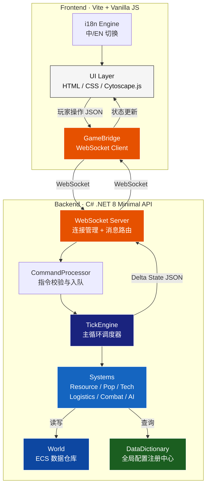

# 《文明模拟器》Demo 实施方案 V2

## 项目背景

基于三份设计文档的综合分析，构建**前后端分离的可玩 Demo 原型**：
- [《文明模拟器》PRD文档.docx](file:///Users/junma/cc-project/open-world-game/doc/idea/《文明模拟器》PRD文档.docx)
- [《文明模拟器》核心产品需求与设计文档v1.0.docx](file:///Users/junma/cc-project/open-world-game/doc/idea/《文明模拟器》核心产品需求与设计文档v1.0.docx)
- [《文明模拟器》游戏核心设定与企划说明书.docx](file:///Users/junma/cc-project/open-world-game/doc/idea/《文明模拟器》游戏核心设定与企划说明书.docx)

---

## Demo 范围定义

| 维度 | Demo 范围 | 完整版（延后） |
|------|-----------|---------------|
| **势力** | 2 个人类势力（玩家 vs AI对手） | 5 种族（兽人/地精/机仆/变异体） |
| **地图** | 15-20 个拓扑节点 | 40-50 节点 |
| **科技** | 人类四大科技树完整 12 节点 | 多种族差异化科技 |
| **战斗** | 近战碰撞 + 远程射线 + 士气 | 暗杀/间谍/逻辑病毒 |
| **物流** | 背夫 → 马车 → 火车 三级 | 地精商队/劫掠 |
| **政治** | 简化继承提示 | 王朝/分裂/内战 |
| **结局** | 征服胜利条件 | 双线结局分歧 |
| **语言** | 中英双语 + 开关切换 | — |

---

## 一、整体架构

### 1.1 系统架构图



### 1.2 技术栈

| 层级 | 技术 | 版本 | 说明 |
|------|------|------|------|
| **后端框架** | .NET Minimal API | .NET 8 | 轻量、高性能、未来兼容 Unity DOTS |
| **后端语言** | C# | 12 | struct/record 用于 Component |
| **序列化** | System.Text.Json | 内置 | WebSocket 消息序列化 |
| **通信** | WebSocket | 原生 | 双向实时推送 |
| **前端构建** | Vite | 6.x | 热更新开发 |
| **前端语言** | Vanilla JavaScript (ES Module) | — | 无框架依赖 |
| **拓扑地图** | Cytoscape.js | 3.x | 节点图渲染 + 交互 |
| **样式** | Vanilla CSS + CSS Variables | — | 白底商务极简风设计系统 |

### 1.3 通信协议

WebSocket 消息统一为 JSON 格式，分两类：

#### 客户端 → 服务端：Command（指令）

```jsonc
{
  "type": "COMMAND",
  "action": "BUILD",           // 指令类型枚举
  "payload": {
    "nodeId": "node_03",
    "buildingType": "FARM",
    "targetLevel": 2
  },
  "seq": 142                   // 客户端序列号，用于ACK
}
```

**指令类型枚举（Demo 范围）**：

| action | 说明 | payload 字段 |
|--------|------|-------------|
| `BUILD` | 建造/升级建筑 | `nodeId`, `buildingType`, `targetLevel` |
| `RESEARCH` | 研发科技 | `techId` |
| `CREATE_ROUTE` | 创建物流线路 | `fromNodeId`, `toNodeId`, `transportType`, `cargoType`, `amount` |
| `CANCEL_ROUTE` | 取消物流线路 | `routeId` |
| `ATTACK` | 下达进攻指令 | `fromNodeId`, `targetNodeId`, `troopCount` |
| `RETREAT` | 撤退指令 | `armyEntityId` |
| `SET_SPEED` | 设置游戏速度 | `speed` (0=暂停, 1=1x, 2=2x, 5=5x) |
| `UPGRADE_EDGE` | 升级道路为铁轨 | `edgeId` |

#### 服务端 → 客户端：State Update（状态推送）

```jsonc
{
  "type": "TICK_UPDATE",
  "tick": 1045,
  "delta": {
    "nodes": {
      "node_03": {
        "inv_food": 1240,
        "inv_iron": 890,
        "pop_count": 56,
        "farm_level": 2,
        "building_queue": null
      }
    },
    "edges": {},
    "entities": {
      "army_07": { "position": 0.6, "edgeId": "e_03_05" },
      "train_01": { "position": 0.9, "edgeId": "e_05_08" }
    },
    "removedEntities": ["army_12"],
    "events": [
      { "type": "COMBAT_LOG", "text_key": "LOG_BATTLE_MELEE", "params": {"attacker":"玩家","defender":"AI","casualties":12} },
      { "type": "TECH_COMPLETE", "techId": "GUNPOWDER" }
    ]
  },
  "ack": 142
}
```

**首次连接推送完整状态**：

```jsonc
{
  "type": "FULL_STATE",
  "tick": 0,
  "world": {
    "nodes": { /* 所有节点完整数据 */ },
    "edges": { /* 所有边完整数据 */ },
    "entities": { /* 所有动态实体 */ },
    "playerFaction": "FACTION_PLAYER",
    "techs": { /* 已解锁科技 */ }
  },
  "dictionaries": {
    /* 客户端需要的字典数据子集（建筑名称、科技描述等展示用） */
  }
}
```

---

## 二、C# 后端架构详细设计

### 2.1 项目结构

```
server/
├── CivilizationSim.sln
├── src/
│   └── CivilizationSim/
│       ├── Program.cs                         # 入口：Minimal API + WebSocket
│       ├── CivilizationSim.csproj
│       │
│       ├── Dict/                              # ═══ 数据字典层 ═══
│       │   ├── DictRegistry.cs                # 字典注册中心 Dict.Get<T>(domain, key)
│       │   ├── ResourceDef.cs                 # 资源定义
│       │   ├── BuildingDef.cs                 # 建筑定义
│       │   ├── TechDef.cs                     # 科技定义
│       │   ├── UnitDef.cs                     # 兵种定义
│       │   ├── TransportDef.cs                # 载具定义
│       │   ├── FactionDef.cs                  # 势力定义
│       │   ├── FormulaDef.cs                  # 公式系数定义
│       │   ├── MapDef.cs                      # 地图拓扑定义
│       │   └── Data/                          # JSON 数据文件
│       │       ├── resources.json
│       │       ├── buildings.json
│       │       ├── techs.json
│       │       ├── units.json
│       │       ├── transports.json
│       │       ├── factions.json
│       │       ├── formulas.json
│       │       └── map_default.json
│       │
│       ├── Ecs/                               # ═══ ECS 核心层 ═══
│       │   ├── World.cs                       # World 容器
│       │   ├── EntityManager.cs               # 实体ID分配
│       │   └── Components/                    # 纯数据 Component
│       │       ├── NodeComponent.cs            # 节点状态
│       │       ├── EdgeComponent.cs            # 边状态
│       │       ├── ArmyComponent.cs            # 军队实体
│       │       ├── LogisticsComponent.cs       # 物流实体
│       │       ├── FactionComponent.cs         # 势力全局状态
│       │       ├── TechStateComponent.cs       # 科技研发状态
│       │       └── BuildQueueComponent.cs      # 建造队列
│       │
│       ├── Systems/                           # ═══ System 逻辑层 ═══
│       │   ├── IGameSystem.cs                 # System 接口
│       │   ├── TickEngine.cs                  # 主循环调度器
│       │   ├── CommandProcessor.cs            # 指令校验 + 入队
│       │   ├── ResourceSystem.cs              # 资源产出/消耗
│       │   ├── PopulationSystem.cs            # 人口增长
│       │   ├── BuildSystem.cs                 # 建造队列推进
│       │   ├── TechSystem.cs                  # 科技研发推进
│       │   ├── LogisticsSystem.cs             # 物流移动
│       │   ├── CombatSystem.cs                # 战斗结算
│       │   ├── MoraleSystem.cs                # 士气计算
│       │   ├── AISystem.cs                    # AI 决策
│       │   └── EventSystem.cs                 # 事件触发
│       │
│       ├── Net/                               # ═══ 网络层 ═══
│       │   ├── WebSocketHandler.cs            # WS 连接管理
│       │   ├── MessageRouter.cs               # 消息路由
│       │   ├── StateSerializer.cs             # 状态序列化 (Full + Delta)
│       │   └── Protocol.cs                    # 协议消息类型定义
│       │
│       └── Utils/                             # ═══ 工具层 ═══
│           ├── Pathfinding.cs                 # Dijkstra 最短路径
│           ├── SeededRandom.cs                # 可种子化随机数
│           └── GameLogger.cs                  # 战报日志生成
```

### 2.2 核心 C# 类型设计

#### Component（纯数据结构体）

```csharp
// ═══ 节点 Component ═══
public record struct NodeComponent
{
    public string    Id;              // "node_01"
    public string    FactionId;       // "FACTION_PLAYER" | "FACTION_AI"
    public int       PopCount;        // 人口
    public int       InvFood;         // 粮食库存
    public int       InvIron;         // 铁矿库存
    public int       InvAmmo;         // 弹药库存
    public int       FarmLevel;       // 农田等级 0-5
    public int       MineLevel;       // 矿山等级 0-5
    public int       ArsenalLevel;    // 兵工厂等级 0-3
    public int       WallLevel;       // 围墙等级 0-3
    public int       WallHpCurrent;   // 围墙当前HP
    public int       BeaconLevel;     // 神谕信号塔等级 0-5 (仅首都)
    public int       GarrisonCount;   // 驻军数量
    public float     Loyalty;         // 忠诚度 0.0-1.0
    public string[]  Tags;            // 地形标签 ["HAS_ORE","HAS_WATER"]
}

// ═══ 边 Component ═══
public record struct EdgeComponent
{
    public string    Id;              // "e_01_03"
    public string    SourceNodeId;
    public string    TargetNodeId;
    public string    EdgeType;        // "DIRT_ROAD" | "RAILWAY"
    public float     Length;          // 路径长度权重
}

// ═══ 军队 Component ═══
public record struct ArmyComponent
{
    public int       EntityId;
    public string    FactionId;
    public int       TroopCount;      // 兵力
    public int       MeleeTroops;     // 近战兵数
    public int       RangedTroops;    // 远程兵数
    public float     Morale;          // 士气 0.0-1.0
    public int       CarryFood;       // 随军粮食
    public int       CarryAmmo;       // 随军弹药
    public string?   CurrentNodeId;   // 当前驻扎节点（移动中为null）
    public string?   CurrentEdgeId;   // 当前所在边（驻扎时为null）
    public float     EdgeProgress;    // 边上移动进度 0.0-1.0
    public string?   TargetNodeId;    // 目标节点
}

// ═══ 物流实体 Component ═══
public record struct LogisticsComponent
{
    public int       EntityId;
    public string    FactionId;
    public string    TransportType;   // "PORTER" | "CARRIAGE" | "TRAIN"
    public string    CargoType;       // "FOOD" | "IRON" | "AMMO"
    public int       CargoAmount;     // 运载量
    public string    FromNodeId;
    public string    ToNodeId;
    public string    CurrentEdgeId;
    public float     EdgeProgress;    // 0.0-1.0
    public bool      Returning;       // 是否在返程
}

// ═══ 势力全局状态 ═══
public record struct FactionComponent
{
    public string    Id;              // "FACTION_PLAYER" | "FACTION_AI"
    public string    Name;            // 势力名称
    public string[]  OwnedNodeIds;    // 所控制的节点列表
    public string[]  UnlockedTechs;   // 已解锁科技ID
    public string?   ResearchingTech; // 当前研发中科技
    public int       ResearchProgress;// 研发进度（已投入Tick数）
    public bool      IsPlayer;        // 是否为玩家控制
}
```

#### System 接口

```csharp
public interface IGameSystem
{
    /// <summary>系统执行优先级（数字越小越先执行）</summary>
    int Order { get; }

    /// <summary>每 Tick 执行一次</summary>
    void Execute(World world, DictRegistry dict, GameLogger logger);
}
```

#### TickEngine 主循环

```csharp
public class TickEngine
{
    private readonly List<IGameSystem> _systems;  // 按 Order 排序
    private readonly World _world;
    private readonly DictRegistry _dict;
    private readonly CommandProcessor _cmdProc;
    private readonly GameLogger _logger;
    private int _currentTick = 0;
    private GameSpeed _speed = GameSpeed.Normal;  // 0=Paused,1=1x,2=2x,5=5x

    /// <summary>执行单个 Tick，返回 Delta 状态</summary>
    public TickDelta ExecuteTick()
    {
        _currentTick++;
        _world.BeginDeltaTracking();

        // 1. 消费玩家指令
        _cmdProc.ProcessPendingCommands(_world, _dict);

        // 2. 按 Order 顺序执行所有 System
        foreach (var system in _systems)
            system.Execute(_world, _dict, _logger);

        // 3. 收集 Delta
        return _world.CollectDelta(_currentTick, _logger.FlushLogs());
    }
}
```

#### DictRegistry 字典注册中心

```csharp
/// <summary>
/// 全局数据字典注册中心。所有游戏常量/配置/公式系数通过此类查询。
/// 禁止在 System 中硬编码任何数值。
/// </summary>
public class DictRegistry
{
    private readonly Dictionary<string, ResourceDef>   _resources;
    private readonly Dictionary<string, BuildingDef>   _buildings;
    private readonly Dictionary<string, TechDef>       _techs;
    private readonly Dictionary<string, UnitDef>       _units;
    private readonly Dictionary<string, TransportDef>  _transports;
    private readonly Dictionary<string, FactionDef>    _factions;
    private readonly FormulaDef                        _formulas;
    private readonly MapDef                            _map;

    /// <summary>从 Data/*.json 加载所有字典</summary>
    public static DictRegistry LoadFromJson(string dataPath) { ... }

    // 类型安全的查询方法
    public ResourceDef   GetResource(string id)   => _resources[id];
    public BuildingDef   GetBuilding(string id)   => _buildings[id];
    public TechDef       GetTech(string id)       => _techs[id];
    public UnitDef       GetUnit(string id)       => _units[id];
    public TransportDef  GetTransport(string id)  => _transports[id];
    public FactionDef    GetFaction(string id)     => _factions[id];
    public FormulaDef    Formulas                  => _formulas;
    public MapDef        Map                       => _map;

    /// <summary>导出客户端需要的字典子集（名称/图标/描述）</summary>
    public ClientDictPayload ExportForClient() { ... }
}
```

### 2.3 System 执行顺序与详细逻辑

```
Tick Pipeline (Order):
  ┌─────────────────────────────────────────────────────┐
  │  10  CommandProcessor   消费玩家指令队列              │
  │  20  BuildSystem        建造队列倒计时，完成时升级     │
  │  30  ResourceSystem     节点资源产出（基于建筑等级）   │
  │  40  PopulationSystem   人口增长 + 粮食消耗 + 饥荒    │
  │  50  TechSystem         科技研发进度推进               │
  │  60  LogisticsSystem    物流实体沿边移动 + 装卸货      │
  │  70  CombatSystem       战斗碰撞/射线 + 围墙 + 伤亡   │
  │  80  MoraleSystem       士气衰减 + 溃散判定            │
  │  90  AISystem           AI 势力决策（建造/进攻/补给）  │
  │ 100  EventSystem        事件触发（叛乱/饥荒/胜利）     │
  └─────────────────────────────────────────────────────┘
```

#### ResourceSystem 核心公式

```
每个节点每 Tick：
  Food_Output  = BUILDING_DICT[FARM].levels[farm_level].output_food
                 × FORMULA.tech_multiplier(unlocked_techs)
  Iron_Output  = min(
                   BUILDING_DICT[MINE].levels[mine_level].output_iron
                   × FORMULA.tech_multiplier(unlocked_techs),
                   RESOURCE_DICT[IRON].bandwidth_base × mine_level   ← 带宽上限
                 )
  Ammo_Output  = BUILDING_DICT[ARSENAL].levels[arsenal_level].output_ammo
                 × FORMULA.arsenal_efficiency
                 （每产 1 弹药消耗 RESOURCE_DICT[AMMO].iron_to_ammo_ratio 铁矿）

  Food_Consumed = pop_count × RESOURCE_DICT[FOOD].consumption_per_pop
                + garrison  × RESOURCE_DICT[FOOD].consumption_per_soldier

  inv_food += Food_Output - Food_Consumed
  inv_iron += Iron_Output - (ammo_production_iron_cost)
  inv_ammo += Ammo_Output
```

#### CombatSystem 核心公式

```
当军队实体到达敌方节点时触发战斗：

  ── 近战阶段 ──
  melee_damage = attacker.melee_troops
                 × UNIT_DICT[MELEE].damage
                 × attacker.morale
  defender_casualties_melee = melee_damage / UNIT_DICT[MELEE].hp
                              × (1 - wall_reduction if wall_hp > 0)

  ── 远程阶段 ──
  ranged_damage = attacker.ranged_troops
                  × UNIT_DICT[current_ranged_type].damage
                  × UNIT_DICT[current_ranged_type].hit_rate
                  × FORMULA.faction_accuracy_bonus
  ammo_consumed = attacker.ranged_troops × UNIT_DICT[current_ranged_type].ammo_per_shot
  defender_casualties_ranged = ranged_damage / UNIT_DICT[target_type].hp

  ── 围墙损伤 ──
  wall_damage = total_melee_damage × FORMULA.wall_damage_ratio
  node.wall_hp_current -= wall_damage （归零后掩体减伤失效）

  ── 士气 ──
  morale_loss = (casualties_this_tick / total_troops) × FORMULA.morale_shock_factor
  if 被高频射线压制: morale_loss × FORMULA.suppression_multiplier
  if morale <= FORMULA.rout_threshold: 强制溃散（Fleeing）
```

---

## 三、前端架构详细设计

### 3.1 项目结构

```
client/
├── index.html
├── package.json
├── vite.config.js
│
├── src/
│   ├── main.js                       # 应用入口
│   │
│   ├── i18n/                          # ═══ 国际化 ═══
│   │   ├── i18n.js                    # i18n 引擎 + 切换开关逻辑
│   │   ├── zh-CN.json                 # 中文语言包
│   │   └── en-US.json                 # 英文语言包
│   │
│   ├── bridge/                        # ═══ 通信层 ═══
│   │   ├── game-bridge.js             # WebSocket 连接 + 消息收发
│   │   ├── command-sender.js          # 封装发送指令的 API
│   │   └── state-store.js             # 客户端状态缓存（接收 delta 合并）
│   │
│   ├── ui/                            # ═══ UI 模块 ═══
│   │   ├── app.js                     # UI 总控 + 布局管理
│   │   ├── map-view.js                # Cytoscape.js 拓扑地图
│   │   ├── hud.js                     # 顶部全局资源 HUD
│   │   ├── info-panel.js              # 右侧节点详情面板
│   │   ├── build-menu.js              # 建造/升级菜单
│   │   ├── tech-tree-panel.js         # 科技树面板
│   │   ├── logistics-panel.js         # 物流调度面板
│   │   ├── battle-log.js              # 底部文字战报
│   │   ├── settings-panel.js          # 设置面板（语言切换/速度控制）
│   │   └── context-menu.js            # 右键菜单（攻击/补给）
│   │
│   ├── dict/                          # ═══ 客户端字典缓存 ═══
│   │   └── client-dict.js             # 缓存服务端下发的字典子集
│   │
│   └── styles/                        # ═══ 样式 ═══
│       ├── index.css                  # 设计系统（CSS Variables + Reset）
│       ├── layout.css                 # 整体布局（Grid）
│       ├── map.css                    # 地图节点/边样式
│       ├── panels.css                 # 面板通用样式
│       ├── hud.css                    # HUD 样式
│       ├── battle-log.css             # 战报区样式
│       └── animations.css             # 动画（脉冲/闪烁/滑入）
```

### 3.2 i18n 国际化方案

```javascript
// i18n/i18n.js
class I18nEngine {
  #locale = 'zh-CN';        // 默认中文
  #packs = {};               // { 'zh-CN': {...}, 'en-US': {...} }

  /** 加载语言包 */
  async load(locale, pack) { this.#packs[locale] = pack; }

  /** 切换语言（触发全局 UI 重绘） */
  setLocale(locale) {
    this.#locale = locale;
    localStorage.setItem('civ_sim_locale', locale);
    document.documentElement.setAttribute('lang', locale);
    EventBus.emit('locale-changed', locale);
  }

  /** 翻译：t('hud.food_label') → "粮食" / "Food" */
  t(key, params = {}) {
    let text = this.#resolve(this.#packs[this.#locale], key) || key;
    // 插值替换: "已消灭 {count} 名敌军" → "已消灭 12 名敌军"
    for (const [k, v] of Object.entries(params))
      text = text.replace(`{${k}}`, v);
    return text;
  }
}

export const i18n = new I18nEngine();
```

语言包示例：

```jsonc
// i18n/zh-CN.json
{
  "app": {
    "title": "纪元实验 · 文明模拟器",
    "subtitle": "PROJECT EVOLUTION"
  },
  "hud": {
    "food_label": "粮食",
    "iron_label": "铁矿",
    "ammo_label": "弹药",
    "pop_label": "人口",
    "tick_label": "回合"
  },
  "building": {
    "FARM": { "name": "农田", "desc": "生产粮食，维持人口生存" },
    "MINE": { "name": "矿山", "desc": "开采铁矿，工业基础骨架" },
    "ARSENAL": { "name": "兵工厂", "desc": "消耗铁矿，转化弹药" },
    "WALL": { "name": "防御围墙", "desc": "城防工事，减少驻军伤亡" },
    "ORACLE_BEACON": { "name": "神谕信号塔", "desc": "帝国心脏，加速科技研发" }
  },
  "tech": {
    "SCAVENGING": { "name": "废墟拾荒", "desc": "允许在节点内收集微量废钢与合成粮" },
    "BLAST_SMELTING": { "name": "高炉熔炼", "desc": "解锁冶炼厂，铁矿产率提高300%" },
    "GUNPOWDER": { "name": "黑火药提取", "desc": "解锁燧发枪兵，获得远程射击能力" }
  },
  "combat": {
    "LOG_BATTLE_START": "[回合 {tick}] {attacker} 向 {target} 发起进攻！",
    "LOG_MELEE_CLASH": "[回合 {tick}] 近战碰撞！{attacker} 损失 {a_loss} 人，{defender} 损失 {d_loss} 人",
    "LOG_RANGED_FIRE": "[回合 {tick}] 火枪齐射！消耗 {ammo} 弹药，击倒 {kills} 名敌军",
    "LOG_ROUT": "[回合 {tick}] {faction} 军队士气崩溃！全军溃散！",
    "LOG_WALL_BREACH": "[回合 {tick}] {node} 围墙被攻破！守军失去掩体保护！"
  },
  "settings": {
    "language": "语言",
    "speed": "游戏速度",
    "paused": "已暂停",
    "speed_1x": "正常",
    "speed_2x": "二倍速",
    "speed_5x": "五倍速"
  }
}
```

```jsonc
// i18n/en-US.json
{
  "app": {
    "title": "Project Evolution · Civilization Simulator",
    "subtitle": "PROJECT EVOLUTION"
  },
  "hud": {
    "food_label": "Food",
    "iron_label": "Iron",
    "ammo_label": "Ammo",
    "pop_label": "Population",
    "tick_label": "Tick"
  },
  "building": {
    "FARM": { "name": "Farm", "desc": "Produces food to sustain population" },
    "MINE": { "name": "Mine", "desc": "Extracts iron ore, backbone of industry" },
    "ARSENAL": { "name": "Arsenal", "desc": "Consumes iron to produce ammo" },
    "WALL": { "name": "Defensive Wall", "desc": "Fortification, reduces garrison casualties" },
    "ORACLE_BEACON": { "name": "Oracle Beacon", "desc": "Heart of empire, accelerates tech research" }
  },
  "combat": {
    "LOG_BATTLE_START": "[Tick {tick}] {attacker} launches assault on {target}!",
    "LOG_RANGED_FIRE": "[Tick {tick}] Gunfire! {ammo} ammo consumed, {kills} hostiles eliminated",
    "LOG_ROUT": "[Tick {tick}] {faction} army morale collapsed! Full rout!"
  },
  "settings": {
    "language": "Language",
    "speed": "Game Speed",
    "paused": "Paused"
  }
}
```

### 3.3 白底商务极简风设计系统

```css
/* styles/index.css — PRD 原设白底商务风 */
:root {
  /* ─── 色彩系统：极简商务 ─── */
  --color-bg-primary:      #FFFFFF;
  --color-bg-secondary:    #F8F9FA;
  --color-bg-panel:        #FFFFFF;
  --color-border:          #E0E0E0;
  --color-border-light:    #F0F0F0;
  --color-text-primary:    #1A1A1A;
  --color-text-secondary:  #6B7280;
  --color-text-muted:      #9CA3AF;

  /* 功能色 */
  --color-accent:          #2563EB;     /* 主操作蓝 */
  --color-success:         #16A34A;     /* 食物/正面 */
  --color-warning:         #D97706;     /* 警告/弹药 */
  --color-danger:          #DC2626;     /* 危险/敌方 */
  --color-iron:            #64748B;     /* 铁矿灰蓝 */

  /* 势力色 */
  --color-faction-player:  #2563EB;     /* 玩家：商务蓝 */
  --color-faction-ai:      #DC2626;     /* AI：警报红 */
  --color-faction-neutral: #9CA3AF;     /* 中立：灰 */

  /* ─── 排版 ─── */
  --font-family:           'Inter', 'Noto Sans SC', -apple-system, sans-serif;
  --font-mono:             'JetBrains Mono', 'Fira Code', monospace;
  --font-size-xs:          11px;
  --font-size-sm:          12px;
  --font-size-base:        13px;
  --font-size-lg:          15px;
  --font-size-xl:          18px;
  --font-size-2xl:         24px;

  /* ─── 间距 ─── */
  --spacing-xs:            4px;
  --spacing-sm:            8px;
  --spacing-md:            12px;
  --spacing-lg:            16px;
  --spacing-xl:            24px;
  --spacing-2xl:           32px;

  /* ─── 效果 ─── */
  --radius-sm:             4px;
  --radius-md:             6px;
  --radius-lg:             8px;
  --shadow-sm:             0 1px 2px rgba(0,0,0,0.05);
  --shadow-md:             0 2px 8px rgba(0,0,0,0.08);
  --shadow-lg:             0 4px 16px rgba(0,0,0,0.1);
  --transition-fast:       120ms ease;
  --transition-normal:     200ms ease;
}

body {
  font-family: var(--font-family);
  font-size: var(--font-size-base);
  color: var(--color-text-primary);
  background: var(--color-bg-secondary);
  margin: 0;
  -webkit-font-smoothing: antialiased;
}
```

### 3.4 UI 布局（白底商务风）

```
┌─────────────────────────────────────────────────────────────────────────┐
│  PROJECT EVOLUTION          🌾 1,240   ⛏️ 890   💥 45   👥 156       │
│  纪元实验 · 文明模拟器       Food      Iron     Ammo    Pop          │
│                                                    Tick: 1045  ⏸ ▶ ⏩  │ ⚙
├─────────────────────────────────────────────┬───────────────────────────┤
│                                             │  ┌─── 节点详情 ─────────┐ │
│                                             │  │ 📍 翡翠矿谷 (node_05) │ │
│                                             │  │ 所属：玩家            │ │
│        ┌─ 白底极简拓扑地图 ─────────┐       │  │ 人口：42              │ │
│        │                            │       │  │ 🌾 380  ⛏️ 620  💥 0  │ │
│        │    ○─────○─────○           │       │  ├─── 建筑 ────────────┤ │
│        │    │           │           │       │  │ 🌱 农田    Lv.2      │ │
│        │    │     ◉─────○           │       │  │ ⛰️ 矿山    Lv.3      │ │
│        │    │     │                 │       │  │ 🏭 兵工厂  未解锁     │ │
│        │    ○─────○                 │       │  │ 🏰 围墙    Lv.1      │ │
│        │                            │       │  │                       │ │
│        │    细灰线 = 土路            │       │  │ [升级农田] [修建围墙]  │ │
│        │    金色线 = 铁路            │       │  └───────────────────────┘ │
│        │    移动方块 = 物流实体       │       │  ┌─── 科技研发 ─────────┐ │
│        └────────────────────────────┘       │  │ 🔬 研发中：黑火药提取  │ │
│                                             │  │ ████████░░ 78%        │ │
│                                             │  │ [打开科技树]           │ │
│                                             │  └───────────────────────┘ │
├─────────────────────────────────────────────┴───────────────────────────┤
│  📋 战报日志                                                    [清除] │
│  [1045] 蒸汽列车 T-01 抵达铁砧要塞，卸载铁矿 400 单位                  │
│  [1043] 翡翠矿谷农田升级至 Lv.2，粮食产出 +12/Tick                     │
│  [1040] ⚔️ 敌军斥候出现在雾岭关隘附近！                                │
│  [1038] 黑火药提取 研发进度 50%                                         │
└─────────────────────────────────────────────────────────────────────────┘
```

---

## 四、完整数据字典规范

> [!IMPORTANT]
> **铁律：所有 System 中使用的数值必须来自 `Dict/Data/*.json`，通过 `DictRegistry` 查询。C# 代码中禁止出现任何裸数字常量（0、1 除外）。**

### 4.1 资源字典 `resources.json`

```jsonc
{
  "FOOD": {
    "id": "FOOD",
    "icon": "🌾",
    "color": "#16A34A",
    "initial_amount": 200,
    "max_per_node": 99999,
    "consumption_per_pop": 1,
    "consumption_per_soldier": 2,
    "starvation_threshold": 0,
    "starvation_morale_penalty": 0.15
  },
  "IRON": {
    "id": "IRON",
    "icon": "⛏️",
    "color": "#64748B",
    "initial_amount": 100,
    "max_per_node": 99999,
    "bandwidth_base": 10
  },
  "AMMO": {
    "id": "AMMO",
    "icon": "💥",
    "color": "#D97706",
    "initial_amount": 0,
    "max_per_node": 99999,
    "iron_to_ammo_ratio": 2
  }
}
```

### 4.2 建筑字典 `buildings.json`

```jsonc
{
  "FARM": {
    "id": "FARM",
    "icon": "🌱",
    "max_level": 5,
    "requires_tag": null,
    "requires_tech": null,
    "levels": {
      "0": { "output_food": 0,  "cost_iron": 0,    "cost_food": 0,   "build_ticks": 0 },
      "1": { "output_food": 5,  "cost_iron": 50,   "cost_food": 20,  "build_ticks": 10 },
      "2": { "output_food": 12, "cost_iron": 150,  "cost_food": 50,  "build_ticks": 20 },
      "3": { "output_food": 25, "cost_iron": 400,  "cost_food": 100, "build_ticks": 35 },
      "4": { "output_food": 45, "cost_iron": 800,  "cost_food": 200, "build_ticks": 50 },
      "5": { "output_food": 80, "cost_iron": 1500, "cost_food": 400, "build_ticks": 70 }
    }
  },
  "MINE": {
    "id": "MINE",
    "icon": "⛰️",
    "max_level": 5,
    "requires_tag": "HAS_ORE",
    "requires_tech": null,
    "levels": {
      "0": { "output_iron": 0,   "cost_iron": 0,    "cost_food": 0,   "build_ticks": 0 },
      "1": { "output_iron": 8,   "cost_iron": 0,    "cost_food": 30,  "build_ticks": 10 },
      "2": { "output_iron": 20,  "cost_iron": 100,  "cost_food": 80,  "build_ticks": 25 },
      "3": { "output_iron": 45,  "cost_iron": 300,  "cost_food": 150, "build_ticks": 40 },
      "4": { "output_iron": 80,  "cost_iron": 700,  "cost_food": 300, "build_ticks": 60 },
      "5": { "output_iron": 150, "cost_iron": 1500, "cost_food": 600, "build_ticks": 80 }
    }
  },
  "ARSENAL": {
    "id": "ARSENAL",
    "icon": "🏭",
    "max_level": 3,
    "requires_tag": null,
    "requires_tech": "GUNPOWDER",
    "levels": {
      "0": { "output_ammo": 0,  "cost_iron": 0,    "cost_food": 0,   "build_ticks": 0 },
      "1": { "output_ammo": 3,  "cost_iron": 500,  "cost_food": 100, "build_ticks": 30 },
      "2": { "output_ammo": 8,  "cost_iron": 1500, "cost_food": 300, "build_ticks": 50 },
      "3": { "output_ammo": 20, "cost_iron": 4000, "cost_food": 800, "build_ticks": 80 }
    }
  },
  "WALL": {
    "id": "WALL",
    "icon": "🏰",
    "max_level": 3,
    "requires_tag": null,
    "requires_tech": null,
    "levels": {
      "0": { "wall_hp": 0,    "cost_iron": 0,    "cost_food": 0,   "build_ticks": 0 },
      "1": { "wall_hp": 200,  "cost_iron": 200,  "cost_food": 50,  "build_ticks": 15 },
      "2": { "wall_hp": 500,  "cost_iron": 600,  "cost_food": 150, "build_ticks": 30 },
      "3": { "wall_hp": 1200, "cost_iron": 2000, "cost_food": 400, "build_ticks": 50 }
    },
    "damage_reduction_when_intact": 0.5
  },
  "ORACLE_BEACON": {
    "id": "ORACLE_BEACON",
    "icon": "📡",
    "max_level": 5,
    "requires_tag": null,
    "requires_tech": null,
    "unique_per_faction": true,
    "levels": {
      "1": { "loyalty_radius": 2, "tech_speed_multiplier": 1.0, "cost_iron": 0,     "build_ticks": 0 },
      "2": { "loyalty_radius": 3, "tech_speed_multiplier": 1.5, "cost_iron": 1000,  "build_ticks": 40 },
      "3": { "loyalty_radius": 4, "tech_speed_multiplier": 2.0, "cost_iron": 3000,  "build_ticks": 60 },
      "4": { "loyalty_radius": 5, "tech_speed_multiplier": 3.0, "cost_iron": 8000,  "build_ticks": 80 },
      "5": { "loyalty_radius": 6, "tech_speed_multiplier": 5.0, "cost_iron": 20000, "build_ticks": 100 }
    }
  }
}
```

### 4.3 科技字典 `techs.json`

```jsonc
{
  "SCAVENGING":     { "id":"SCAVENGING",     "category":"BUILD",   "cost":{},                       "prereq":[],                              "unlocks":["BASE_GATHER"],                    "default":true,  "research_ticks":0 },
  "BLAST_SMELTING": { "id":"BLAST_SMELTING", "category":"BUILD",   "cost":{"IRON":500},             "prereq":["SCAVENGING"],                  "unlocks":["SMELTER","IRON_OUTPUT_X3"],       "default":false, "research_ticks":30 },
  "STANDARDIZATION":{ "id":"STANDARDIZATION","category":"BUILD",   "cost":{"IRON":2000},            "prereq":["BLAST_SMELTING"],              "unlocks":["WORKSHOP","BUILD_SPEED_X1.5"],    "default":false, "research_ticks":50 },

  "PORTERS":        { "id":"PORTERS",        "category":"TRANSIT", "cost":{},                       "prereq":[],                              "unlocks":["PORTER_UNIT"],                    "default":true,  "research_ticks":0 },
  "CARRIAGES":      { "id":"CARRIAGES",      "category":"TRANSIT", "cost":{"FOOD":300,"IRON":200},  "prereq":["PORTERS"],                     "unlocks":["CARRIAGE_UNIT"],                  "default":false, "research_ticks":25 },
  "STEAM_RAILWAY":  { "id":"STEAM_RAILWAY",  "category":"TRANSIT", "cost":{"IRON":10000},           "prereq":["CARRIAGES","STANDARDIZATION"], "unlocks":["TRAIN_UNIT","RAILWAY_EDGE"],      "default":false, "research_ticks":80 },

  "SHANTY_TOWN":    { "id":"SHANTY_TOWN",    "category":"FOOD",    "cost":{"FOOD":100},             "prereq":[],                              "unlocks":["REFUGEE_CAMP","POP_GROWTH"],      "default":false, "research_ticks":15 },
  "AGRI_NETWORK":   { "id":"AGRI_NETWORK",   "category":"FOOD",    "cost":{"IRON":800},             "prereq":["SHANTY_TOWN"],                 "unlocks":["LARGE_FARM","WATER_FOOD_BOOST"],  "default":false, "research_ticks":40 },
  "CANNING":        { "id":"CANNING",        "category":"FOOD",    "cost":{"IRON":3000},            "prereq":["AGRI_NETWORK","BLAST_SMELTING"],"unlocks":["FOOD_FACTORY","FOOD_DECAY_HALF"],"default":false, "research_ticks":60 },

  "BLACKSMITHING":  { "id":"BLACKSMITHING",  "category":"WEAPON",  "cost":{"IRON":50},              "prereq":[],                              "unlocks":["MELEE_WEAPON"],                   "default":false, "research_ticks":10 },
  "GUNPOWDER":      { "id":"GUNPOWDER",      "category":"WEAPON",  "cost":{"FOOD":1000,"IRON":500}, "prereq":["BLACKSMITHING","BLAST_SMELTING"],"unlocks":["MUSKETEER","ARSENAL_BUILDING"], "default":false, "research_ticks":50 },
  "AUTO_FIREARMS":  { "id":"AUTO_FIREARMS",  "category":"WEAPON",  "cost":{"IRON":10000,"AMMO":5000},"prereq":["GUNPOWDER","STANDARDIZATION"],"unlocks":["MAXIM_GUN","AMMO_LINE"],        "default":false, "research_ticks":100 }
}
```

### 4.4 兵种字典 `units.json`

```jsonc
{
  "MILITIA": {
    "id": "MILITIA",
    "icon": "🗡️",
    "type": "MELEE",
    "hp": 10,
    "damage": 3,
    "speed": 1.0,
    "requires_tech": null,
    "cost_food": 5,
    "cost_iron": 0,
    "food_per_tick": 1,
    "ammo_per_shot": 0
  },
  "SWORDSMAN": {
    "id": "SWORDSMAN",
    "icon": "⚔️",
    "type": "MELEE",
    "hp": 20,
    "damage": 8,
    "speed": 1.0,
    "requires_tech": "BLACKSMITHING",
    "cost_food": 8,
    "cost_iron": 10,
    "food_per_tick": 1,
    "ammo_per_shot": 0
  },
  "MUSKETEER": {
    "id": "MUSKETEER",
    "icon": "🔫",
    "type": "RANGED",
    "hp": 12,
    "damage": 15,
    "hit_rate": 0.6,
    "range": 3,
    "speed": 0.8,
    "requires_tech": "GUNPOWDER",
    "cost_food": 10,
    "cost_iron": 15,
    "food_per_tick": 1,
    "ammo_per_shot": 1
  },
  "MAXIM_GUN": {
    "id": "MAXIM_GUN",
    "icon": "💀",
    "type": "RANGED",
    "hp": 30,
    "damage": 50,
    "hit_rate": 0.8,
    "range": 5,
    "speed": 0.3,
    "requires_tech": "AUTO_FIREARMS",
    "cost_food": 20,
    "cost_iron": 100,
    "food_per_tick": 2,
    "ammo_per_shot": 5,
    "suppression_factor": 2.0
  }
}
```

### 4.5 运输载具字典 `transports.json`

```jsonc
{
  "PORTER": {
    "id": "PORTER",
    "icon": "🚶",
    "speed": 0.1,
    "capacity": 20,
    "requires_tech": "PORTERS",
    "requires_edge_type": null,
    "food_consumption_per_tick": 1,
    "description_key": "transport.porter"
  },
  "CARRIAGE": {
    "id": "CARRIAGE",
    "icon": "🐴",
    "speed": 0.25,
    "capacity": 80,
    "requires_tech": "CARRIAGES",
    "requires_edge_type": "DIRT_ROAD",
    "food_consumption_per_tick": 2,
    "description_key": "transport.carriage"
  },
  "TRAIN": {
    "id": "TRAIN",
    "icon": "🚂",
    "speed": 0.5,
    "capacity": 500,
    "requires_tech": "STEAM_RAILWAY",
    "requires_edge_type": "RAILWAY",
    "food_consumption_per_tick": 0,
    "iron_consumption_per_tick": 1,
    "description_key": "transport.train"
  }
}
```

### 4.6 公式系数字典 `formulas.json`

```jsonc
{
  "population": {
    "base_growth_rate": 0.02,
    "growth_food_threshold": 1.5,
    "max_pop_per_farm_level": 20,
    "starvation_death_rate": 0.05
  },
  "combat": {
    "melee_morale_weight": 1.0,
    "ranged_morale_weight": 0.8,
    "morale_shock_factor": 2.5,
    "suppression_multiplier": 1.8,
    "rout_threshold": 0.2,
    "wall_damage_ratio": 0.3,
    "wall_damage_reduction": 0.5,
    "defender_terrain_bonus": 1.2
  },
  "loyalty": {
    "base_loyalty": 1.0,
    "loyalty_decay_per_distance": 0.12,
    "rebellion_threshold": 0.3,
    "beacon_loyalty_bonus_per_level": 0.1
  },
  "tech": {
    "base_research_speed": 1,
    "beacon_speed_multiplier_per_level": [1.0, 1.0, 1.5, 2.0, 3.0, 5.0]
  },
  "logistics": {
    "porter_food_cost_per_distance": 0.5,
    "edge_base_length_dirt": 5.0,
    "edge_base_length_railway": 3.0
  }
}
```

### 4.7 地图字典 `map_default.json`

```jsonc
{
  "nodes": [
    { "id":"n01", "name_key":"map.node.genesis",       "x":120,  "y":580, "tags":["HAS_WATER"],            "faction":"PLAYER", "is_capital":true },
    { "id":"n02", "name_key":"map.node.iron_ridge",     "x":220,  "y":500, "tags":["HAS_ORE"],              "faction":"PLAYER" },
    { "id":"n03", "name_key":"map.node.emerald_valley", "x":350,  "y":550, "tags":["HAS_WATER","HAS_ORE"],  "faction":"PLAYER" },
    { "id":"n04", "name_key":"map.node.windmill_plain", "x":300,  "y":420, "tags":["HAS_WATER"],            "faction":"NEUTRAL" },
    { "id":"n05", "name_key":"map.node.fog_pass",       "x":450,  "y":460, "tags":[],                       "faction":"NEUTRAL" },
    { "id":"n06", "name_key":"map.node.crossroad",      "x":500,  "y":350, "tags":[],                       "faction":"NEUTRAL" },
    { "id":"n07", "name_key":"map.node.dusty_outpost",  "x":400,  "y":300, "tags":["HAS_ORE"],              "faction":"NEUTRAL" },
    { "id":"n08", "name_key":"map.node.great_bridge",   "x":550,  "y":250, "tags":[],                       "faction":"NEUTRAL" },
    { "id":"n09", "name_key":"map.node.oasis",          "x":630,  "y":380, "tags":["HAS_WATER"],            "faction":"NEUTRAL" },
    { "id":"n10", "name_key":"map.node.iron_heart",     "x":680,  "y":280, "tags":["HAS_ORE","HAS_ORE"],    "faction":"NEUTRAL" },
    { "id":"n11", "name_key":"map.node.shadow_gorge",   "x":600,  "y":170, "tags":[],                       "faction":"NEUTRAL" },
    { "id":"n12", "name_key":"map.node.north_bastion",  "x":720,  "y":140, "tags":["HAS_ORE"],              "faction":"AI" },
    { "id":"n13", "name_key":"map.node.crimson_field",  "x":780,  "y":220, "tags":["HAS_WATER"],            "faction":"AI" },
    { "id":"n14", "name_key":"map.node.steel_citadel",  "x":830,  "y":130, "tags":["HAS_ORE","HAS_WATER"],  "faction":"AI", "is_capital":true },
    { "id":"n15", "name_key":"map.node.eastern_mine",   "x":850,  "y":300, "tags":["HAS_ORE"],              "faction":"AI" },
    { "id":"n16", "name_key":"map.node.traders_rest",   "x":480,  "y":180, "tags":["HAS_WATER"],            "faction":"NEUTRAL" },
    { "id":"n17", "name_key":"map.node.anvil_fort",     "x":200,  "y":360, "tags":["HAS_ORE"],              "faction":"NEUTRAL" }
  ],
  "edges": [
    { "id":"e01", "source":"n01", "target":"n02", "type":"DIRT_ROAD", "length":3.0 },
    { "id":"e02", "source":"n01", "target":"n03", "type":"DIRT_ROAD", "length":4.0 },
    { "id":"e03", "source":"n02", "target":"n04", "type":"DIRT_ROAD", "length":3.5 },
    { "id":"e04", "source":"n02", "target":"n17", "type":"DIRT_ROAD", "length":3.0 },
    { "id":"e05", "source":"n03", "target":"n05", "type":"DIRT_ROAD", "length":4.0 },
    { "id":"e06", "source":"n04", "target":"n05", "type":"DIRT_ROAD", "length":3.5 },
    { "id":"e07", "source":"n04", "target":"n07", "type":"DIRT_ROAD", "length":3.0 },
    { "id":"e08", "source":"n05", "target":"n06", "type":"DIRT_ROAD", "length":3.0 },
    { "id":"e09", "source":"n06", "target":"n08", "type":"DIRT_ROAD", "length":3.5 },
    { "id":"e10", "source":"n06", "target":"n09", "type":"DIRT_ROAD", "length":4.0 },
    { "id":"e11", "source":"n07", "target":"n08", "type":"DIRT_ROAD", "length":3.5 },
    { "id":"e12", "source":"n07", "target":"n16", "type":"DIRT_ROAD", "length":3.0 },
    { "id":"e13", "source":"n08", "target":"n11", "type":"DIRT_ROAD", "length":3.0 },
    { "id":"e14", "source":"n09", "target":"n10", "type":"DIRT_ROAD", "length":3.0 },
    { "id":"e15", "source":"n10", "target":"n12", "type":"DIRT_ROAD", "length":3.5 },
    { "id":"e16", "source":"n10", "target":"n15", "type":"DIRT_ROAD", "length":4.0 },
    { "id":"e17", "source":"n11", "target":"n12", "type":"DIRT_ROAD", "length":3.0 },
    { "id":"e18", "source":"n11", "target":"n16", "type":"DIRT_ROAD", "length":3.5 },
    { "id":"e19", "source":"n12", "target":"n14", "type":"DIRT_ROAD", "length":3.0 },
    { "id":"e20", "source":"n13", "target":"n14", "type":"DIRT_ROAD", "length":2.5 },
    { "id":"e21", "source":"n13", "target":"n15", "type":"DIRT_ROAD", "length":3.0 },
    { "id":"e22", "source":"n17", "target":"n07", "type":"DIRT_ROAD", "length":4.0 }
  ],
  "factions": {
    "PLAYER": {
      "id": "PLAYER",
      "name_key": "faction.player",
      "color": "#2563EB",
      "capital_node": "n01",
      "starting_nodes": ["n01","n02","n03"],
      "starting_resources": { "food": 200, "iron": 100, "ammo": 0 },
      "starting_pop": 30,
      "starting_techs": ["SCAVENGING","PORTERS"],
      "is_player": true
    },
    "AI": {
      "id": "AI",
      "name_key": "faction.ai_rival",
      "color": "#DC2626",
      "capital_node": "n14",
      "starting_nodes": ["n12","n13","n14","n15"],
      "starting_resources": { "food": 300, "iron": 200, "ammo": 0 },
      "starting_pop": 40,
      "starting_techs": ["SCAVENGING","PORTERS","BLACKSMITHING"],
      "is_player": false
    }
  }
}
```

### 4.8 势力字典 `factions.json`

```jsonc
{
  "PLAYER": {
    "id": "PLAYER",
    "race": "HUMAN",
    "accuracy_bonus": 0.2,
    "morale_base": 0.8,
    "ai_aggression": 0,
    "ai_expand_priority": 0,
    "ai_tech_priority": 0
  },
  "AI": {
    "id": "AI",
    "race": "HUMAN",
    "accuracy_bonus": 0.2,
    "morale_base": 0.8,
    "ai_aggression": 0.6,
    "ai_expand_priority": 0.7,
    "ai_tech_priority": 0.5,
    "ai_build_weights": {
      "FARM": 0.3,
      "MINE": 0.35,
      "ARSENAL": 0.2,
      "WALL": 0.15
    },
    "ai_attack_threshold": 1.5,
    "ai_defend_threshold": 0.8
  }
}
```

---

## 五、分阶段实施计划

### Phase 1：项目骨架 + 数据字典 + 通信管线 [基础联通]

**目标**：C# 后端启动 → WebSocket 连接 → 前端显示拓扑地图 → Tick 跑起来

- [ ] 初始化 .NET 8 项目 (`server/`)
- [ ] 初始化 Vite 前端项目 (`client/`)
- [ ] 实现 `DictRegistry` + 所有 JSON 数据文件
- [ ] 实现 ECS 核心：`World`、`EntityManager`、`Components`
- [ ] 实现 `TickEngine` 空壳（按序调用 System，但 System 内容为空）
- [ ] 实现 WebSocket 服务端 + 客户端 `GameBridge`
- [ ] 实现状态序列化（`FULL_STATE` 推送）
- [ ] Cytoscape.js 地图渲染（17 个节点 + 22 条边 + 势力颜色）
- [ ] HUD 资源显示条
- [ ] CSS 设计系统（白底商务风）
- [ ] i18n 引擎 + 中英语言包骨架 + 切换开关

### Phase 2：资源经济 + 建造系统 [内政循环]

**目标**：节点产出资源 → 玩家建造升级 → 人口增长 → 经济循环可玩

- [ ] `ResourceSystem`：基于建筑等级计算产出/消耗
- [ ] `PopulationSystem`：人口增长 + 饥荒惩罚
- [ ] `BuildSystem`：建造指令 → 队列 → 倒计时完成
- [ ] `CommandProcessor`：`BUILD` 指令校验
- [ ] 节点详情面板（Info Panel）
- [ ] 建造菜单（Build Menu）
- [ ] Delta 增量推送

### Phase 3：科技树 + 物流系统 [生产力扩展]

**目标**：研发科技 → 解锁建筑/兵种/载具 → 物流运输资源

- [ ] `TechSystem`：科技研发进度 + 解锁判定
- [ ] 科技树面板 UI
- [ ] `LogisticsSystem`：物流实体创建 → 沿边脉冲移动 → 到达装卸
- [ ] 物流可视化（Cytoscape 边上移动的动画方块）
- [ ] 物流调度面板 + 创建线路交互
- [ ] `UPGRADE_EDGE` 铁轨升级指令

### Phase 4：战斗系统 + AI [军事对抗]

**目标**：编组军队 → 进攻敌节点 → 近战/远程结算 → AI 反击

- [ ] `CombatSystem`：近战碰撞 + 远程射线 + 围墙 + 伤亡
- [ ] `MoraleSystem`：士气衰减 + 溃散
- [ ] `AISystem`：AI 建造优先级 + 扩张决策 + 进攻判定
- [ ] 军事指令交互（右键攻击/撤退）
- [ ] 文字战报系统（Battle Log）
- [ ] 胜利条件检查（占领对方首都）

### Phase 5：打磨 + 文档 [交付]

- [ ] 事件系统（叛乱/饥荒提示）
- [ ] 游戏速度控制（暂停/1x/2x/5x）
- [ ] 节点 Hover 预览
- [ ] 右键上下文菜单
- [ ] 物流断链警告
- [ ] 微动画润色（节点脉冲、资源跳数、战报滑入）
- [ ] 开发文档撰写（`dev-docs/`）
- [ ] 字典完整性校验脚本

---

## 六、开发约束总则

### 6.1 数据约束
| 编号 | 约束 | 说明 |
|------|------|------|
| D-01 | **零硬编码** | 所有数值常量必须来自 `Dict/Data/*.json` |
| D-02 | **字典必备字段** | 每个字典条目必须包含 `id` 字段 |
| D-03 | **UI 文本走 i18n** | 所有面向用户的文字必须通过 `i18n.t(key)` 查询 |
| D-04 | **带宽限制** | 矿场储量无限但受每 Tick 产出上限约束 |
| D-05 | **资源非负** | 任何资源库存不得为负数，消耗前检查 |

### 6.2 架构约束
| 编号 | 约束 | 说明 |
|------|------|------|
| A-01 | **System 无状态** | System 类禁止持有实例字段，所有数据在 World 中 |
| A-02 | **单向数据流** | 前端 → Command → System → World → Delta → 前端 |
| A-03 | **Tick 确定性** | 相同初始状态 + 指令序列 = 相同结果（可重放） |
| A-04 | **ECS 纯数据** | Component 使用 `record struct`，禁止包含方法逻辑 |
| A-05 | **前后端解耦** | 前端仅通过 WebSocket JSON 通信，禁止共享代码 |

### 6.3 代码约束
| 编号 | 约束 | 说明 |
|------|------|------|
| C-01 | **C# 命名规范** | PascalCase 属性，camelCase 局部变量 |
| C-02 | **JSON 命名规范** | snake_case 键名 |
| C-03 | **前端 ES Module** | 全部使用 `import/export`，禁止全局变量 |
| C-04 | **XML 文档注释** | C# 所有 public 成员必须有 `<summary>` |
| C-05 | **JSDoc 注释** | JS 所有导出函数必须有 `@param` / `@returns` |

---

## 七、验证计划

### Automated Tests
```bash
# 1. 后端编译
cd server && dotnet build

# 2. 字典完整性（所有 prereq 引用的 tech 存在，所有 requires_tech 存在）
dotnet run --project server -- --validate-dicts

# 3. Tick 确定性回放测试
dotnet test server/CivilizationSim.Tests

# 4. 前端开发服务器
cd client && npm run dev
```

### Manual Verification（逐 Phase 验收）
1. **Phase 1**：浏览器打开 → 看到白底拓扑地图 + HUD → 语言切换中/英 → Tick 数字在跳动
2. **Phase 2**：点击节点 → 面板显示详情 → 点击升级农田 → 下一 Tick 建造队列倒计时 → 粮食产出增加
3. **Phase 3**：点击研发科技 → 进度条推进 → 解锁新建筑 → 创建物流线路 → 小方块沿边移动
4. **Phase 4**：右键敌节点 → 军队出发 → 战报区输出战斗日志 → AI 反击 → 胜负判定
5. **Phase 5**：完整游玩一局（约 10 分钟），验证经济平衡与 AI 挑战性

### Browser Testing
- 使用 Chrome DevTools 在 `http://localhost:5173` 验证前端
- 检查 WebSocket 连接在 Network 面板中正常收发消息
- Cytoscape.js 节点交互（点击/Hover/右键）工作正常
